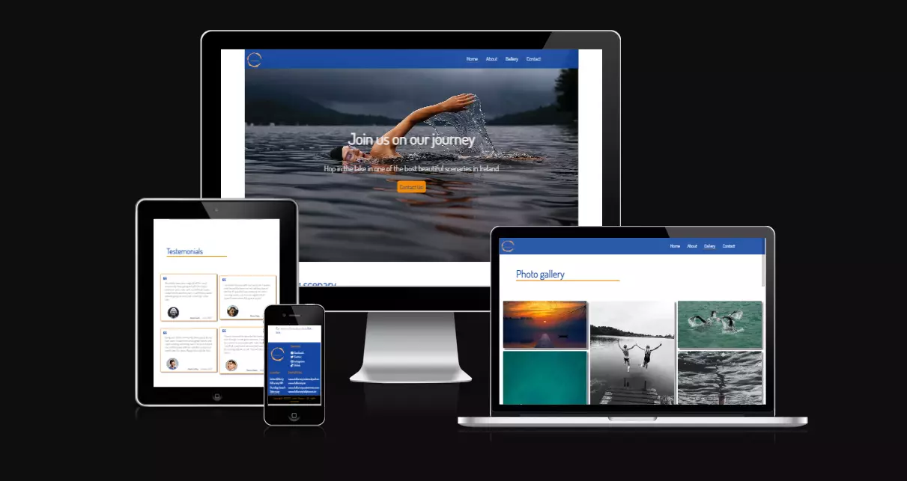
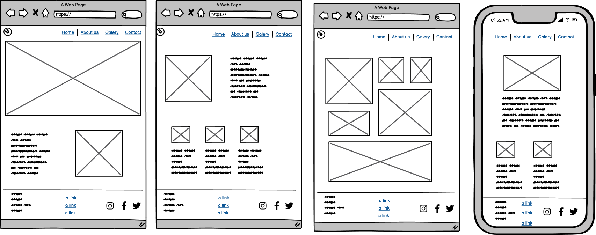
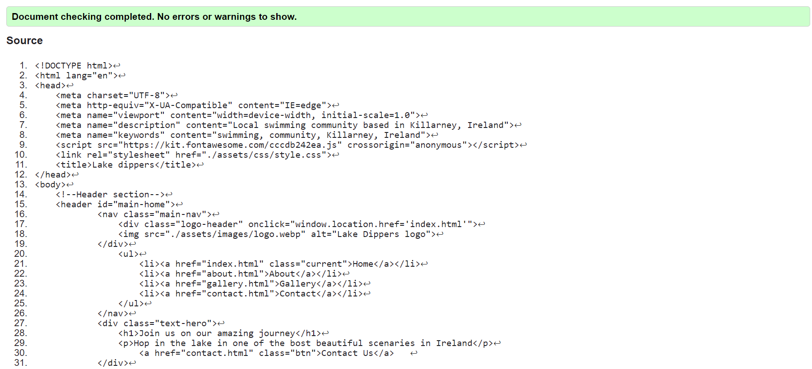
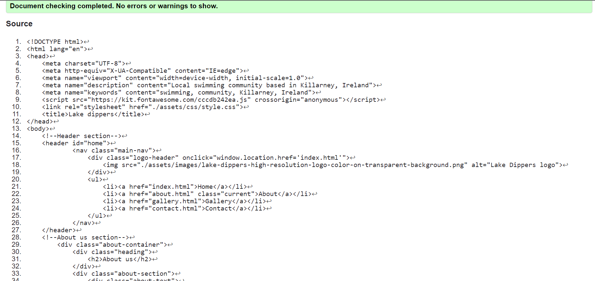
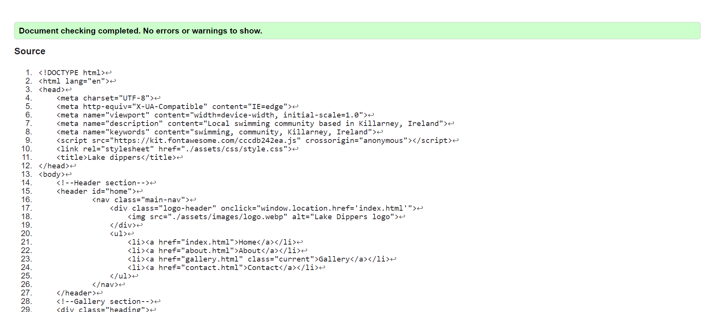
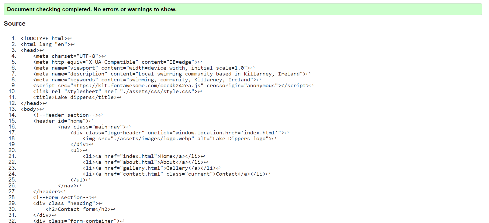
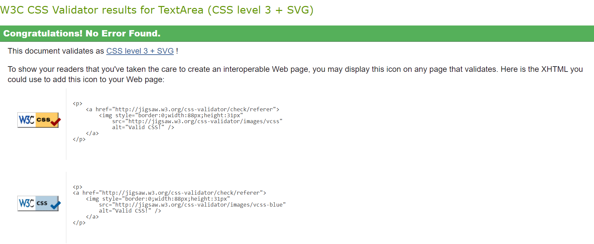
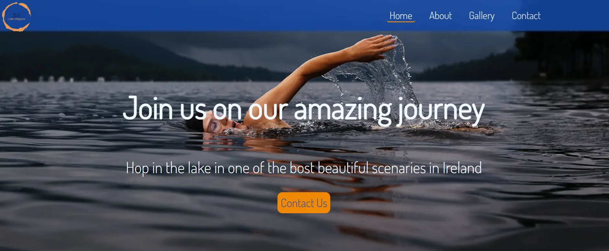
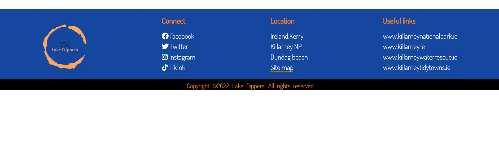

# Lake Dippers
Lake Dippers is fully responsive website, created for local swimming community based in Killarney co.Kerry. Focus of the wesite is to provide information about activities, community and to promote healthy and active side of life. With online presence it's expected to incurage more people to join 'Lake dippers' and to increase our membership.

## User Experience (UX)
- ### User stories
#### 1. First time visitor goals
- As a first time visitor, I want to understand purpose of this site and to easily navigate through it
- As a first time visitor, I want to be able to find pictures &/or user stories to      
   further confirm their work to me
 - As a first time visitor, I want to be able to see where they are based and get options 
   for how to get in contact with them, e.g. their social links/a contact form
####  2.  Returning visitor goals
 - As a returning visitor, I want to be able to contact them and get a response to my - enquiries.
 - As a returning visitor, I want to find links to other community groups who use the National Park area for recreation.
#### 3. Frequent user goals
 - As a frequent user, I want to view some updated pictures from 'events' or just regular meet-ups
 - As a frequent user, I want to read new user stories and experiences 
- As a frequent user, I want to check to see if there is any news, or any new updates on the website

 ### Design
- ####  Colour Scheme
  - The colour scheme chosen for this project are 'Tangerine' colour with it's hex value of '#f18805', which was used for borders, hover effects and headings in footer section. The majority of the website was in 'Yale Blue' colour with it's hex value of '#1446a0', which was used as background colour for navigation bar, footer and big heading texts. 

- ####  Typography 
  - The Dosis font is the main font used throughout the whole website with Sans Serif as the fallback font in case for any reason the font isn't being imported into the site correctly.

 - ####  Imagery
   - The large, background hero image stretches through the landing page and is designed to be striking and catch the user's attention at the very first glance and to give user idea about the website. There are small images in the 'About us' &'Home' page which chelp to explain the content, and there is 'Gallery' page which contains most of the images. 

## Technologies Used 
 ### Languages Used 
- HTML5 
- CSS3
 ### Frameworks, Libraries & Programes Used
- #### [Google fonts](https://fonts.google.com/knowledge)
Google fonts were used to import the 'Dosis' font into the style.css file which is used on all pages throughout the project
 - #### [Font Awesome](https://fontawesome.com/)
Font Awesome was used on all pages throughout the website to add icons for aesthetic and UX purposes.
 - #### [Git](https://gitpod.io/)
Git was used for version control by utilizing the Gitpod terminal to commit to Git and Push to GitHub.
  - #### [GitHub](https://github.com/)
GitHub is used to store the projects code after being pushed from Git.
 - #### [Balsamic](https://balsamiq.com/wireframes/?gclid=Cj0KCQiA14WdBhD8ARIsANao07g6CkndNmxQPlHP92mM3VQBwb6lbQIg5FPinhmNFxWsAnM7BpA_PukaAldMEALw_wcB)
Balsamiq was used to create the wireframes during the design process

## Testing
 - HTML 
   - for testing my HTML code i used 
    [W3C Markup Validator](https://validator.w3.org/#validate_by_input) and found no errors
 
   -  
  This is result for index.html page 
 
   - 
 This is result for about.html page
 
   - 
 This is result for about.html page using W3C Markup Validator
 
   - 
 This is result for contact.html 

- CSS 
  - for testing CSS code i used [W3C CSS Validator](https://jigsaw.w3.org/css-validator/) and had found no errors in code
  - 
This is result for style.css page 
## Testing user stories
- First time visitor goal
  -  As a first time visitor I want ot understand purpose of this site and to easily navigate through
     - Upon entering site I can see clear big background image with swimmer and big hero text description which idea matches user websitsite description 
     - In the top left corner of the page there is clear logo with the name of the website 
     - In the same line as logo there is navigation bar which is eaisly to navigate through and it's design to never entrap user and to have clear page links we can look into if we want to, also there is another button-link in the middle of the background image in home page which colours and contrast attracts user to get in contact with them
      
  - As a first time visitor, I want to be able to find pictures &/or user stories to      
   further confirm their work to me
    - I can navigate myself to the 'Gallery' page in which I can find dozen of images of the website so I can look at their activities, there are also images on 'home' page and 'about' page which are related to their community  
    - in 'Home' page while scroling down I can see big testemonial section with 4 users confirming their work and give credibitlity to their website
    - testemonials sections shows image, name & date of the person who wrote thier review/experience that they had by joining 'Lake Dippers'   
  - As a first time visitor, I want to be able to see where they are based and get options for how to get in contact with them, e.g. their social links/ contact form
    - in the footer of each page there is 'Location' section which gives me address with site map link that takes me directly into new tab on google maps with pin-down location on where they are based
    - also in the footer of each page there are social links which will take me to all social media pages that 'Lake Dippers' are having account and using it for their social interaction with users
    - this is screenshoot of the footer with information
    
    - there is option to direct contact on the website, which I can find under 'contact' page
- Returning visitor goal
  - As a returning visitor, I want to be able to contact them and get a response to my enquiries.
    -   I can click on any social media links with each one of them taking me to social network pages which 'Lake Dippers' are having account and using it for their social interaction with users
    - or if I wish to contact them directlyon the website I can either click on the 'Contact' link in the navigation menu or big button'contact-us' in the middle of the home-page on the background image that takes me directly into 'Contact' page where I can fill out form with information and submit it
  - As a returning visitor, I want to find useful links that are realeted to this community and their activities
    - in the footer section there are 4 links that directs me to websites about the park/town- area in what their community is based and also site for emergency services in case of accident/incident
    - also there are other links on 'About' page which help me to explore more about sections about benefits of swimming & cold water which are briefly explained on their website
- Frequent user goals
  - As a frequent user, I want to see updated pictures from events or just regular meet-ups
    - user would be familiar with the navigation through the page so can easily find gallery and see if there is any new images in it
  - As a frequent user, I want to read new user stories and experiences 
    - user is comfortable with navigation so can easily find testemonial section and just by looking at the date in the corner of eact testemonial can determin has there be any updates on the website regarding user stories
  - As a frequent user, I want to check to see if there are any new updates /section/pages/content
    - simple navigation style and friendly user website gives me easy access to quickly check through website to look for any new sections/pages/content
### Further testing
- I've tested that this page works in different browsers
  -  Chrome, Firefox, Microsoft Edge, Safari
- I've tested that this website is responsive, and looks good on all standard screen sizes
   - smallest Galaxy 8= 360px all the way up to 1400px
- I've confirmed that webiste has good visibility contrast and it's easy readable for user, with good contrast colours
- image of the accessibility performance
 
 - I've tested that all internal links are working properly and navigate me through the pages, and clicking on logo takes me back to the home page
    - internal links: Home, About, Gallery, Contact, Logo, as well as Contact us button on hero image
 - I've tested that all external links are taking me to new tab and to related pages that where either in discription or in text
   - external links: Facebook, Twitter, Instagram, Tik-tok, Site-map-google maps, Killarney Np, Killarney town, Killarney water rescue, Killarney tiddy towns
 - I've tested form that works properly
   -  requires entries in every field, will only accept email in the email field, that button works, after submision of input we get conformation from Code institute website
 - image of form-tests performed
 .webp)
 ## Bugs
- as I was buliding website I was constantly debuging and changing my code
- I had big performance issues in the beggining with the webiste but I've managed to improve it by shrinking the size of my images, and converting them from .jpg file to .webp
  - I tried performance test on different browsers and always getting different scores from it
  - to reduce page load of the gallery on mobile version I moved out few pictures for smaller devices
## Features
 - Navigation
   - navigation is placed on top of the page it shows clicklable logo in the top left corner which will bring us on directly on the home page 
   - other navigation links are on the right side in particular order: Home, About, Gallery, Contact
- Home
    - on this page there is big hero image with clickable button 'contact us' that directly brings us to the contact form
    - there are also two sections on this page: 
        - genereal information about area that community is located in with clear image of the lake
        - 4 small testemonial boxes with user experience stories
- About
    - about us page gives us information about history and who we are in general, big group swimmer picture gives us mor
    - there are also two small sections in which are explained healthy benefits and aspects that this community is promoting
    - also there are two external links which can provide user with more information about those health benefits
- Gallery
    - this page gives user more eye-catching description of our community without user having to read anything about us or to navigate through website
- Contact 
    - standard form with input for first name, last name, email, phone number and message box
    - this page allows user to get in dirrect contact with  us and can write any message or ask question that he have 
- Footer
    - footer is devided in 4 boxes with privacy policy on the verry bottom of the website
        - same as in footer there is clickable logo which will take user to the 'home' page
        - user can find links to our social media acounts
        - user can get address of our community group with link to the location
        - user can find usefull links that ties this group to local area which he can explore and get know little bit more about it
## Deployment
- Github pages
    - This project was deployed to GitHub Pages using the following steps
      - Log in to GitHub and locate the GitHub Repository
      - At the top of the Repository (not top of page), locate the "Settings" Button on 
        the menu.
      - Scroll down the Settings page until you locate the "GitHub Pages" Section.
      - Under "Source", click the dropdown called "None" and select "Master Branch".
      - The page will automatically refresh.
      - Scroll back down through the page to locate the now published site link in the "GitHub Pages" section.
      - live link for the page can be found here [Lake dippers](https://tmarkec.github.io/Lake-dippers/)
- Forking the GitHub Repository
    - By forking the GitHub Repository we make a copy of the original repository on our GitHub account to view and/or make changes without affecting the original repository by using the following steps
     - Log in to GitHub and locate the GitHub Repository
     - At the top of the Repository (not top of page) just above the "Settings" Button on the menu, locate the "Fork" Button.
     - You should now have a copy of the original repository in your GitHub account.
- Making a Local Clone
   - Log in to GitHub and locate the GitHub Repository
   - Under the repository name, click "Clone or download".
   -  To clone the repository using HTTPS, under "Clone with HTTPS", copy the link.
   - Open Git Bash
   - Change the current working directory to the location where you want the cloned directory to be made
   - Type git clone, and then paste the URL you copied in Step 3.
      - $ git clone https://github.com/YOUR-USERNAME/YOUR-REPOSITORY
   - Press Enter. Your local clone will be created.
## Credits
  - Code & Content
    -  I give credits to [Stack overflow](https://www.stackoverflow.com/),  [MDN Web Docs](https://developer.mozilla.org/en-US/) & [W3 Schools](https://www.w3schools.com/) for helping me resolve issues while coding through  
    - inspiration for my header section and navigation bar came from [Traversity media](https://www.youtube.com/@TraversyMedia) videos
    - Love running project from [Code Institute](https://codeinstitute.net/ie/) inspired me for the Gallery page
    - credits for hover effect over images goes to [Brandsmen](https://thebrandsmen.com/css-image-hover-effects/)
  - Media
    - credit for my images accross the website goes to [Unsplash](https://unsplash.com/) and [Pexell](https://www.pexels.com/) which I used accross my website
    - for my logo I give credit to [app-logo](https://app.logo.com/) for easily generating my idea and automaticly creating logo for my website
    - instructions how to create my favicon came from [MDN Web Docs](https://developer.mozilla.org/en-US/)
  - Acknowledgment
    - special thank you goes to my mentor Narander who guided me through my project
    - I would like to thank tuttor support from Code Institue for their help, as well as whole Code Institue for giving me opportunity to attend this course and to work on this project
    - I would also like to thank my collegaues for their support
    - last but not least I would like to thank Irene from Code Institute for giving guidance and schedules on daily basis in the classroom
