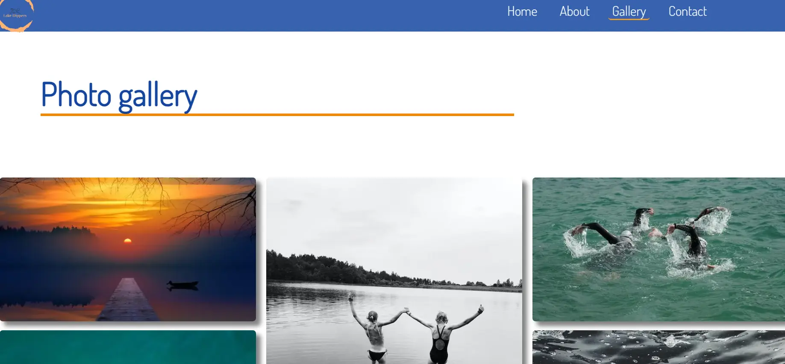
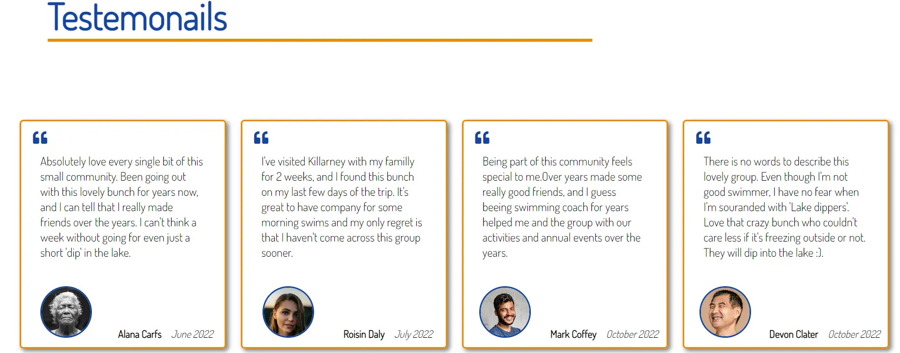

# Lake Dippers
Lake Dippers is fully responsive website, created for local swimming community based in Killarney co.Kerry. Focus of the wesite is to provide information about our activities, our community and to promote healthy and active side of life. Also with online presence it's expected to incurage more people to join 'Lake dippers' and to increase our membership.

## User Experience (UX)
- ### User stories
#### 1. First time visitor goals
- As a first time visitor, I want to understand purpose of this site and to easily navigate through it.
- As a first time visitor, I want to be able to find pictures &/or user stories to      
   further explain their work to me.
 - As a first time visitor, I want to be able to see where they are based and get options 
   for how to get in contact with them, e.g. their social links/a contact form
####  2.  Returning visitor goals
 - As a returning visitor, I want to be able to contact them and get a response to my - enquiries.
 - As a returning visitor, I want to find links to other community groups who use the National Park area for recreation.
#### 3. Frequent user goals
 - As a frequent user, I want to view some updated pictures from 'events' or just regular meet-ups
 - As a frequent user, I want to read new user stories and experiences 
- As a frequent user, I want to check to see if there is any news, or any new updates on the website

 - ### Design
#### 1. Colour Scheme
The colour scheme chosen for this project are 'Tangerine' colour with it's hex value of '#f18805', which was used for borders, hover effects and headings in footer section. The majority of the website was in 'Yale Blue' colour with it's hex value of '#1446a0', which was used as background colour for navigation bar, footer and big heading texts. 

#### 2. Typography 
The Dosis font is the main font used throughout the whole website with Sans Serif as the fallback font in case for any reason the font isn't being imported into the site correctly.

  #### 3. Imagery
Imagery is important. The large, background hero image stretches through the landing page and is designed to be striking and catch the user's attention at the very first glance. There are small images in the 'About us' page as well as in the 'Gallery' page which were used from Pexell and Unsplash website.

## Features 
Responsive on all device sizes

## Technologies Used 
 ### Languages Used 
- HTML5 
- CSS3
 ### Frameworks, Libraries & Programes Used
- #### Google fonts
Google fonts were used to import the 'Dosis' font into the style.css file which is used on all pages throughout the project
 - #### Font Awesome
Font Awesome was used on all pages throughout the website to add icons for aesthetic and UX purposes.
 - #### Git
Git was used for version control by utilizing the Gitpod terminal to commit to Git and Push to GitHub.
  - #### GitHub
GitHub is used to store the projects code after being pushed from Git.
 - #### Balsamic
Balsamiq was used to create the wireframes during the design process

## Testing
 The W3C Markup Validator and W3C CSS Validator Services were used to validate every page of the project to ensure there were no syntax errors in the project.
 ### index.html page
  
 This is result for index.html page using W3C Markup Validator 
 ### about.html
 
 This is result for about.html page using W3C Markup Validator
 ### gallery.html
 
 This is result for about.html page using W3C Markup Validator
 ### contact.html
 
 This is result for contact.html page using W3C Markup Validator
### style.css

This is result for style.css page using W3C CSS Validator Services
## Testing user stories
- First time visitor goal
  -  As a first time visitor I want ot understand purpose of this site and to easily navigate through
     - Upon entering site user get clear big background image with swimmer and big hero text description, from which user can get the idea about webiste  
     - In big here image there is also 'Contact us' link if I wish to make contact without using navigation bar, by putting it in the big hero image with contrast it attracts user more, that link which will take user straight into to the page with contact form. 
     - On the very top of the page there is navigation bar which is readable and I can easily navigate thorugh to go to any of the other 3 pages that I likes, also bottom border showes me in which page I am currently on the website. I can also click logo in top left corner which will take me dirrectly to the 'Home' page.
     - this is the screenshot of the navigation bar
      
  - As a first time visitor, I want to be able to find pictures &/or user stories to      
   further confirm their work to me.
    - I can easily navigate myself to 'Gallery' page which will display imges of the website so I can look more for their work
    - this is screenshot of gallery page which clearly display 'lake dippers' work and activities
    
    - in 'Home' page while scroling down I can see  big testemonial section with 4 users confirming their work and give credibitlity to theirwebsite
    - testemonials sections shows image, name & date of the person who wrote thier review/experience that they had by joining 'Lake Dippers' #
    -this is screen shot of testemonials section
    
  - As a first time visitor, I want to be able to see where they are based and get options for how to get in contact with them, e.g. their social links/ contact form
    - by srolling down the page in footer section there is community address with site map link, which takes me directly into new tab on google maps with pin-down location, on where they are based
    - also in the footer there are social links which will take me to all social medai pages that 'Lake Dippers' are having account and using it
    - this is screenshoot of the footer with information
    - this is screenshoot of the footer section
    
    - if I wish to send them privatly message I can either click on the 'Contact' in navigation menu or big button in the middle of the home page